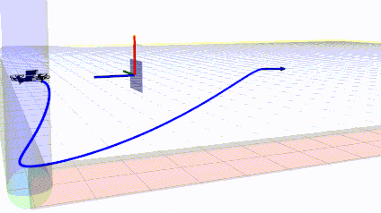
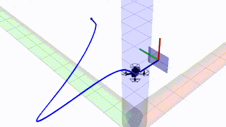
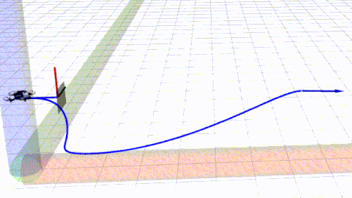
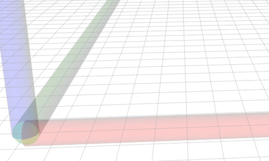

# SlapDrone_Perch

## 0. Overview
**SlapDrone_Perch** Here we develop a method to perching our slapDrone in real forest. This project including indoor test code and ourdoor test code. Indoor test will rely on the position message from OptiTrack, and outdoor test will rely on the relative position message from vision.

**Authors**: Liming Zheng 

**Paper**: Perching in real forest [in progress, will submitted in July 2023]

**Video Links**: 
## 1. Simulation of Aerial Perching

>Preparation and visualization:
```
git clone https://github.com/ZJU-FAST-Lab/Fast-Perching
cd Fast-Perching
catkin_make
source devel/setup.zsh
chmod +x sh_utils/pub_triger.sh
roslaunch planning perching.launch
```

>Start the perching planner:
```
./sh_utils/pub_triger.sh
```
<p align="center">
    
</p>

>Change the position, veliocity and orientation of the landing plate:
```html
<!-- DIR: src/planning/launch/perching.launch -->
  <param name="perching_px" value=""/>
  <param name="perching_py" value=""/>
  <param name="perching_pz" value=""/>
  <param name="perching_vx" value=""/>
  <param name="perching_vy" value=""/>
  <param name="perching_vz" value=""/>
  <param name="perching_axis_x" value=""/>
  <param name="perching_axis_y" value=""/>
  <param name="perching_axis_z" value=""/>
  <param name="perching_theta" value=""/>
```

<p align="center">
    
</p>

## 2. Other Settings or Functions

>Enable replan module of the planner:
```html
<!-- DIR: src/planning/launch/perching.launch -->
  <param name="replan" value="true"/>
```
<p align="center">
    
</p>

>Enable pause debug module of the planner:
```html
<!-- DIR: src/planning/launch/perching.launch -->
  <param name="pause_debug" value="true"/>
```

<p align="center">
    
</p>

## 3. Acknowledgement
We use [**MINCO**](https://github.com/ZJU-FAST-Lab/GCOPTER) as our trajectory representation.

We develop our project from [Fast-Perching](https://github.com/ZJU-FAST-Lab/Fast-Perching)